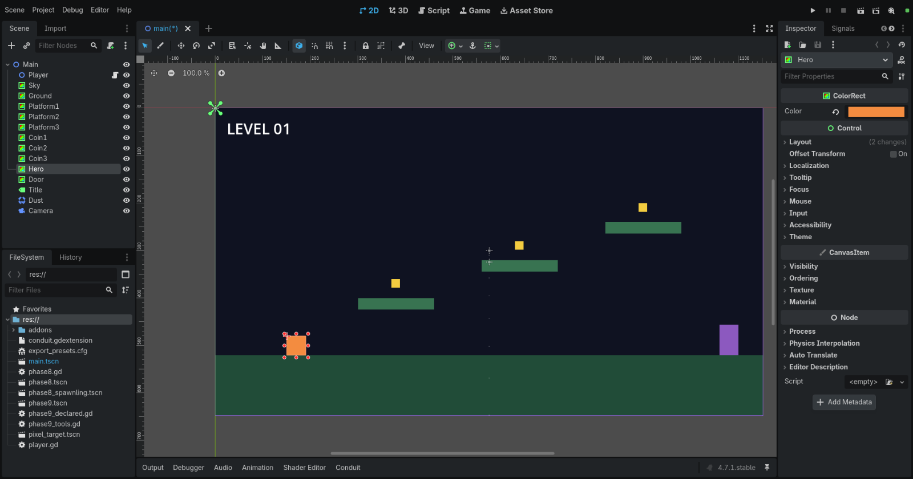
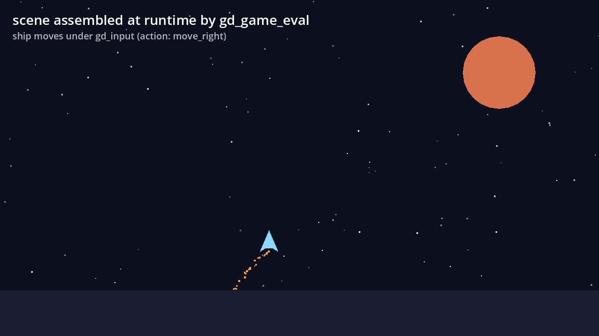
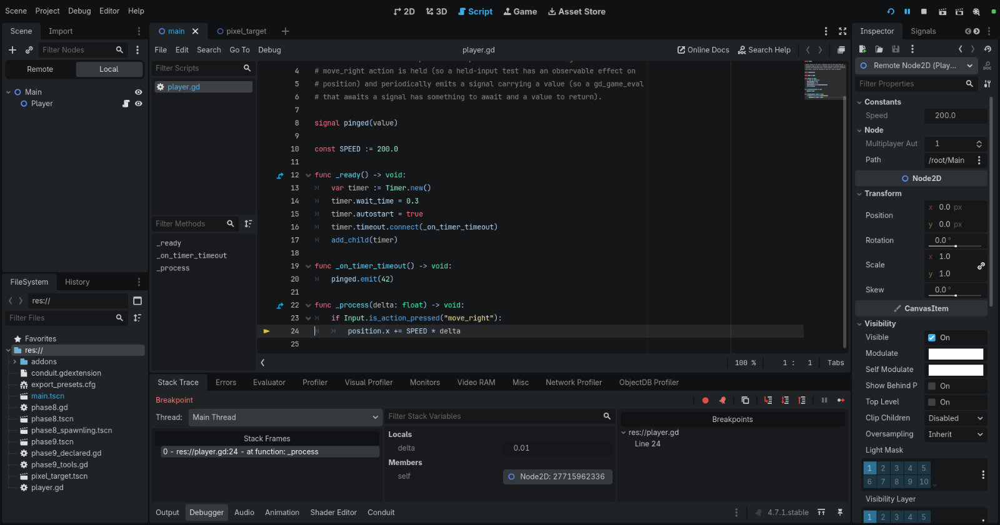

# Conduit

[](https://github.com/Advik-B/ConduitMCP/actions/workflows/ci.yml)
[](https://github.com/Advik-B/ConduitMCP/releases)
[](LICENSE)

Conduit gives an AI agent full, native control of the Godot editor and the running game. It is not a file-level integration: a Rust GDExtension loads into the Godot process itself, so the agent edits scenes undo-safely inside a live editor, presses play, watches frames, injects input, sets breakpoints, and inspects the halted game, through one MCP server.

## Watch it work


One editor session, recorded end to end: [the full take is `docs/media/demo.mp4`](docs/media/demo.mp4), around 1 min 45 s. It runs at real speed with no cuts, and the loop above is a few seconds lifted from each chapter of that same recording. Every caption is the MCP tool call being made at that moment. The sequence of calls is scripted so the video is reproducible from a checkout rather than different every take, but the calls themselves are the ordinary MCP tool surface with no opt-in flags, and what you see is a real editor responding to them.

1. **Building a scene through the editor's own API**: a new scene, then a level assembled node by node with typed properties, the scene dock and inspector following along.
2. **Writing a script, checking it compiles, attaching it**: `gd_script_create`, `gd_script_validate`, `gd_script_attach`, then the script open in the editor at the line that matters.
3. **Signals, groups, the input map, and a saved scene**: the wiring that turns a scene into a game, all persisted.
4. **Every edit is in the editor's own undo history**: repeated `gd_undo` takes the level apart node by node until nothing is left, then `gd_redo` puts it back. This is what a file-level integration cannot do.
5. **Running the game and driving it with simulated input**: `gd_play`, a held movement action, live property reads off the running node, time scale.
6. **The project's own methods, surfaced as MCP tools**: a node in the `conduit_tools` group turns `spawn_coins` into `gd_project_spawn_coins`, and calling it spawns coins in the running game.
7. **A breakpoint, tripped by the agent, read in the editor**: the game halts on `player.gd:24`, and the call stack, locals, and remote inspector are all there.
8. **What is left behind is an ordinary Godot project**: a normal `.tscn` and normal `.gd` files, in the project where a human would have put them.

Reproduce it with `bun run demo`, which drives a throwaway copy of `example-project/` and regenerates both files (Linux only; see [docs/api-gaps.md](docs/api-gaps.md)).

## How it works

Two pieces:

- **Bridge**: a Rust GDExtension (`addons/conduit/`) loaded by the Godot editor and by the game it launches. The same library runs in both contexts: the editor bridge speaks the editor's own APIs (undo/redo, scene docks, the debugger plugin), the game bridge works the live scene tree.
- **Broker**: a single-binary MCP stdio server your MCP client launches. It connects to both bridges over local IPC (named pipe on Windows, Unix socket elsewhere) and presents them as one tool surface.

Nothing listens on the network, and the bridge refuses to activate in release builds, so shipping a game with the addon installed never ships a code-execution listener. The full design is in the [whitepaper](docs/conduit-whitepaper.md).

## What the agent can do

87 tools, 82 exposed by default and the rest behind opt-in flags. The broad strokes:

- **Edit scenes the way the editor does**: open, create, and save scenes; add, remove, reparent, rename, and duplicate nodes; set properties with full Godot typing (vectors, colors, resources); attach and validate scripts; wire signals and groups; manage autoloads and the input map. Every mutation is undo-wrapped, so one `gd_undo` reverses it and the developer's undo history stays coherent.



- **Run and observe the game**: `gd_play` launches the game and connects its bridge; then the agent reads and writes live node properties, calls methods, simulates keyboard, mouse, gamepad, and touch input, waits precise frame counts, pauses and steps, reads logs and errors, and captures screenshots of what the game actually rendered.



  That frame is the game's own rendering, captured with `gd_screenshot`. The scene in it was assembled at runtime by `gd_game_eval`, and the ship sits mid-flight because the agent was holding a movement action through `gd_input` when it took the shot.

- **Debug interactively**: set breakpoints, trigger them with simulated input, then read the call stack and frame variables, step over and into, and continue, through the editor's own debugger.



- **Ground itself in the engine**: query ClassDB for any class's properties, methods, and signals, so the agent works from the engine's actual API surface instead of guessing.
- **Stay legible to the human**: select and inspect nodes in the developer's editor, open scripts at a line, observe and dismiss dialogs, and capture editor screenshots, so a person watching the editor can follow what the agent is doing. A toolbar indicator shows the link state, the editor's Output log carries a line per undo-wrapped action, and a Conduit bottom panel lists the tool-call history.
- **Expose project-defined tools**: methods on nodes in a `conduit_tools` group appear as first-class MCP tools with typed schemas, so a project can teach the agent verbs like `gd_project_spawn_wave`.

## Requirements

- Godot 4.4 or newer (developed and tested against 4.7.1).
- Prebuilt bridge platforms: Windows x64, Linux x64 (glibc 2.35+), macOS universal (Intel and Apple silicon).
- Node.js 20+ (tested on 22) or [Bun](https://bun.sh) 1.2+, to run the broker from npm. A standalone binary that needs neither is on [Releases](https://github.com/Advik-B/ConduitMCP/releases).
- Any MCP client: Claude Code, Claude Desktop, or anything else that speaks MCP over stdio.

## Install the addon

1. Download `conduit-addon-vX.Y.Z.zip` from [Releases](https://github.com/Advik-B/ConduitMCP/releases) and extract it into your project root, so the files land under `addons/conduit/`.
2. Open the project once so Godot loads the extension. Editor-side tools work from here.
3. For game-side tools (play, input, screenshots, eval), add the runtime autoload: Project Settings, Globals, Autoload, add `res://addons/conduit/conduit_runtime.tscn` with the name `ConduitRuntime`.

On macOS, clear the quarantine attribute after extracting: `xattr -dr com.apple.quarantine addons/conduit`.

## Run the broker

The broker is on npm as [`conduit-mcp-server`](https://www.npmjs.com/package/conduit-mcp-server). There is nothing to install ahead of time: point your MCP client at it and the package is fetched on first run.

Claude Code (`.mcp.json` in your project, or `claude mcp add`):

```json
{
  "mcpServers": {
    "godot": {
      "command": "npx",
      "args": ["-y", "conduit-mcp-server", "--project", "/absolute/path/to/your-godot-project"],
      "env": {
        "CONDUIT_ENABLE": "1",
        "CONDUIT_GODOT": "/absolute/path/to/godot"
      }
    }
  }
}
```

On Bun, use `bunx` as the `command` and drop the `-y`. Pin a version with `conduit-mcp-server@X.Y.Z` if you would rather not track the latest.

Claude Desktop uses the same entry under `mcpServers` in `claude_desktop_config.json`.

The two environment variables are optional but recommended:

- `CONDUIT_ENABLE=1` lets the game-side bridge activate in games launched from an editor the broker started (`gd_editor_launch`). If you launch the editor yourself and want game-side tools, start it with this variable set: `CONDUIT_ENABLE=1 godot --editor --path .`
- `CONDUIT_GODOT` tells the broker which engine binary `gd_editor_launch` and `gd_project_scaffold` should use. Without it the agent can still attach to an editor you opened yourself.

Editor-side tools need no opt-in: the broker finds any running editor for the configured project automatically.

Keep the broker and the addon on the same version. The npm package and the addon zip are released together from the same tag, so an `X.Y.Z` addon expects an `X.Y.Z` broker; pinning the version in `args` is the simplest way to keep them in step.

Two alternatives to npm, if you want them:

- **Standalone binary**, for a machine with neither Node nor Bun. Download it for your platform from [Releases](https://github.com/Advik-B/ConduitMCP/releases) (`conduit-mcp-server-windows-x64.exe`, `conduit-mcp-server-linux-x64`, `conduit-mcp-server-darwin-arm64`, or `conduit-mcp-server-darwin-x64`), `chmod +x` it on Linux and macOS, clear quarantine on macOS (`xattr -d com.apple.quarantine <binary>`), and use its absolute path as the `command` with `args: ["--project", "..."]`.
- **From a clone**, for working on Conduit itself: `bun install --frozen-lockfile`, then `bun /path/to/repo/broker/src/index.ts` as the `command` with the same args.

## Flags and safety

The broker's full configuration surface:

| Flag | Env | Effect |
| --- | --- | --- |
| `--project <path>` | `CONDUIT_PROJECT` | The Godot project to attach to (required, or `CONDUIT_SOCK`). |
| `--godot <path>` | `CONDUIT_GODOT` | Engine binary for `gd_editor_launch` and `gd_project_scaffold`. |
| `--enable-pixel-tools` | `CONDUIT_ENABLE_PIXEL_TOOLS` | Enable coordinate-level editor mouse tools (off by default). |
| `--enable-editor-eval` | `CONDUIT_ENABLE_EDITOR_EVAL` | Enable `gd_editor_eval`, GDScript in the editor process (off by default). |
| `--disable-eval` | `CONDUIT_DISABLE_EVAL` | Drop the whole eval class: `gd_game_eval`, `gd_editor_eval`, networking tools, project-defined tools. |

The safety properties are structural, not configuration:

- Bridge and broker talk over local IPC only. The broker's only external interface is MCP on stdio; no TCP port is opened by default.
- The bridge listener never activates in a release build, enforced in code and covered by a test. Release export presets additionally exclude the bridge binaries.
- In a game process (debug builds included) the bridge activates only with an explicit opt-in: the `--conduit` user argument or `CONDUIT_ENABLE`.
- File tools are confined to `res://` and `user://` paths.

## Building from source

Rust stable (edition 2024) and Bun 1.2+:

```
cargo build --release
bun install --frozen-lockfile
```

The bridge library lands in `target/release/`; `bridge/conduit.gdextension` shows the development-layout manifest that loads it straight from the cargo target directory. `bun test` in `broker/` runs the broker unit tests; the `tests/evals/` phase runners are integration acceptance tests that drive a real Godot editor (see `scripts/setup.ts` for fetching a pinned engine build). `scripts/capture-media.ts` regenerates the screenshots above through Conduit's own screenshot tools, and `bun run demo` (`scripts/demo/`) re-records the video at the top by driving a live editor while capturing the display it renders to.

## Status and compatibility

All nine roadmap phases of the [whitepaper](docs/conduit-whitepaper.md) are implemented, with scripted acceptance checks per phase. Tested pairing: Godot 4.7.1 with gdext 0.5.4; the addon declares `compatibility_minimum 4.4`. Platform notes and known engine API gaps are tracked in [docs/api-gaps.md](docs/api-gaps.md).

## License

[MIT](LICENSE)
