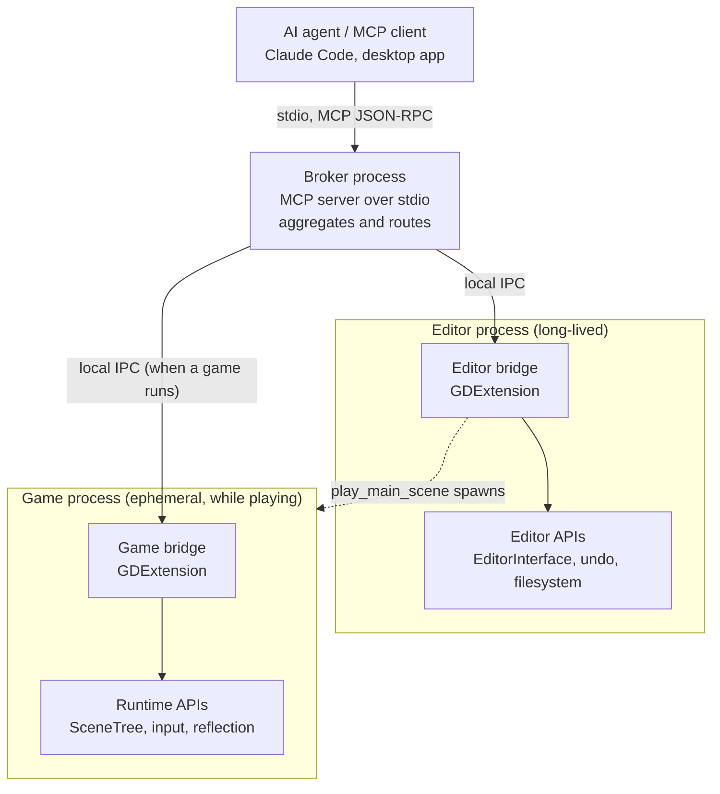
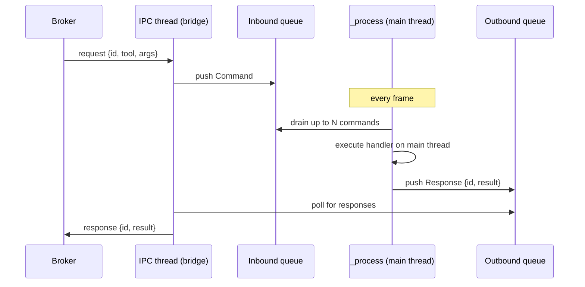

# Conduit: A Native In-Process Bridge for Full Agentic Control of the Godot Engine

**A design whitepaper and implementation specification**

Version 0.3 (draft) · Target: Godot 4.4+ · Bridge language: Rust (gdext) · Status: implemented (phases 1-9 landed)

---

## How to read this document

This whitepaper has two audiences and is written to serve both without compromise.

If you are a **human reader** evaluating the idea, read sections 1 through 6, then the worked examples in section 14. They cover the motivation, a survey of what already exists, the design goals, and the architecture, with diagrams. Sections 7 onward are the engineering specification and can be skimmed.

If you are an **AI coding agent** assisting with the build, treat sections 6 through 12, section 15, and the appendices as your authoritative specification. Section 6 defines the architecture and the one hard constraint (main-thread marshalling) that every component depends on. Section 7 defines the wire protocols precisely enough to implement. Section 10 is the phased build plan with acceptance criteria you can check work against. Appendix D contains explicit working instructions for you specifically. When this document and your prior training disagree about Godot or MCP APIs, prefer this document, then verify against the linked sources, because both ecosystems move quickly.

The project name **Conduit** and the tool prefix **`gd_`** used throughout are working placeholders. They can be renamed with a find-and-replace before or during implementation without affecting any of the design.

---

## 1. Abstract

Existing Model Context Protocol (MCP) integrations for the Godot game engine fall into two families. The first operates at the file level: an external process reads and rewrites `.tscn`, `.gd`, and `.tres` files on disk. The second runs a GDScript autoload inside a running game that listens on a TCP socket, paired with a separate headless Godot process that reparses scene files for edit-time changes. Both families leave a gap between what the agent can do and what a human developer can do. The file-level approach cannot press play, observe rendering, simulate input, or inspect runtime state. The autoload approach can do those things at runtime but performs edit-time changes by clobbering scene files out from under a live editor, desynchronising the open session and bypassing the undo stack.

Conduit closes that gap with a single native bridge, written in Rust as a GDExtension, loaded into the Godot process itself. The same compiled library runs in two contexts. In the editor process it exposes edit-time control through Godot's own editor APIs, so every change flows through the same undo history and file-system notifications that a human's clicks would. In a running game process it exposes runtime control through the live scene tree: node inspection, arbitrary script evaluation, input simulation, signal wiring, and screenshots. The editor bridge additionally drives Godot's interactive debugger, so the agent can set breakpoints, step, and read stack state, and both bridges expose the engine's class reflection so the agent can ground itself in the exact API of the engine build it is driving. A thin broker process presents both contexts to the agent as one unified MCP server over stdio.

The result is an integration where an agent can perform, through documented engine APIs, essentially any action a developer performs through the editor and the running game. Where no semantic API exists, control degrades gracefully through two further, explicitly bounded tiers: direct manipulation of the editor's own control tree, and, as a last resort, pixel-level input against the editor window.

---

## 2. Motivation

### 2.1 The three modes of interacting with Godot

A developer touches Godot in three distinct modes, and no single technical mechanism covers all three well.

**Edit-time.** The editor is open and the project is not running. The developer creates and arranges nodes, writes scripts, edits scenes and resources, adjusts project settings, configures import settings for assets, and enables plugins. The correct substrate for this work is the editor process itself, through `EditorInterface`, `EditorUndoRedoManager`, and `EditorFileSystem`. Changes made this way participate in the undo stack, refresh the open scene tabs and the inspector, and trigger the filesystem rescan that a manual file edit would not.

**Runtime.** A game is running, either launched from the editor or standalone. Here the developer observes behaviour, exercises input, watches for errors, checks performance, and debugs. The correct substrate is the live `SceneTree` of the running game: reading and writing node properties, calling methods, evaluating expressions, injecting input events, connecting to signals, and capturing frames.

**Direct GUI manipulation.** Some actions have no clean semantic API and are only reachable by operating the editor's widgets: dragging gizmos in the 3D viewport, some interactions in the TileSet and animation editors, and native operating-system file dialogs. This is the smallest mode and the only one that genuinely resists a clean programmatic interface. It is also smaller than it first appears, because the editor is itself a Godot application whose docks, dialogs, and buttons are `Control` nodes in a scene tree; many interactions that look GUI-only are reachable by operating those controls through the object API rather than through pixels (section 6.8).

The key observation is that edit-time and runtime are not the same process. When you run a game from the Godot editor, the editor spawns the game as a separate operating-system process. Edit-time control must target the long-lived editor process; runtime control must target the ephemeral game process. Any design that treats "Godot" as a single endpoint will get this wrong.

### 2.2 Why current approaches leave a gap

**File-level MCP servers** give an agent read and write access to the project's source files. The agent can parse a `.tscn` to understand scene structure and rewrite a `.gd` script. What it cannot do is interact with the engine at all. It cannot press play and watch the game run, it cannot see rendering output, it cannot test whether a physics interaction feels right, it cannot observe framerate or detect a visual glitch, and it cannot step a debugger or read a runtime variable. This is the fundamental limit of a file-level bridge: it sees the source, never the engine.

**GDScript autoload plus external process** is the more capable family, used by the most complete open-source projects. A GDScript node registered as an autoload listens on a TCP socket inside the running game and executes commands; a separate Node.js or TypeScript MCP server translates agent tool calls into those socket commands. For edit-time work, these projects shell out to a *second* headless Godot process invoked as `godot --headless --script godot_operations.gd`, which parses and rewrites scene files directly.

This works, and the runtime half is genuinely comprehensive in the best implementations. A second omission, however, is shared by every project in section 3: none exposes Godot's interactive debugger. An agent can print and evaluate, but it can never set a breakpoint, step a line, or read a stack frame's locals, which are the first things a human reaches for when investigating a bug. The main weakness beyond that is edit-time correctness. Rewriting a `.tscn` file on disk while the editor has that scene open desynchronises the two: the editor's in-memory representation and the file no longer agree until the developer manually reimports, and the change never entered the undo stack, so it cannot be undone with the same gesture as every other edit. For an agent that is meant to work alongside a human in the same session, silently clobbering files is the wrong primitive.

Conduit's premise is that the runtime problem is largely solved and worth reimplementing only because doing so natively removes a process hop, while the edit-time problem is not solved and is the part worth doing properly.

---

## 3. Prior art

The following projects define the current landscape. They are worth studying both to borrow their capability taxonomy and to understand precisely where Conduit diverges architecturally.

| Project | Architecture | Approx. tools | Edit-time method | Notes |
|---|---|---|---|---|
| Coding-Solo/godot-mcp | TypeScript MCP server driving Godot CLI | ~20 | Headless CLI operations | The original; foundational architecture that others fork |
| tugcantopaloglu/godot-mcp | Fork of the above; TypeScript server, GDScript autoload on TCP 9090, headless CLI | ~149 | Headless CLI reparse of `.tscn` | The most comprehensive; excellent capability checklist including `game_eval` with `await`, input injection, signals, physics, audio, 3D and 2D systems |
| mkdevkit/godot-mcp | Node.js server, WebSocket to a GDScript editor plugin on 6505 | dozens | Editor plugin commands | Uses an editor plugin (not headless CLI) so edits touch the live editor; runtime bridge polls a JSON file |
| tomyud1/godot-mcp | Node.js server, WebSocket to editor plugin on 6505, browser visualiser | ~42 | Editor plugin commands | Similar shape to mkdevkit; adds a visualiser |
| 3ddelano/gdai-mcp-plugin-godot | MCP server plus GDScript editor plugin | dozens | Editor plugin commands | Screenshots of editor and running game for visual grounding |
| **Conduit (this design)** | Rust GDExtension in-process, thin stdio broker | consolidated (section 8) | Native editor APIs through the undo manager | Adds interactive debugger control, ClassDB introspection, and an editor-control-tree tier below semantic APIs |

Three structural facts stand out. First, every existing project uses GDScript on the Godot side and a separate runtime (Node.js or Python) for the MCP server, communicating over TCP or WebSocket. None loads a native library into the engine. Second, the projects split on edit-time method: the CLI-reparse camp rewrites files, and the editor-plugin camp routes through a live editor plugin. The editor-plugin camp is closer to correct; Conduit takes that idea further by making the plugin native and routing edits through the undo manager explicitly. Third, none of the surveyed projects integrates the editor's interactive debugger or exposes the engine's class reflection to the agent; Conduit treats both as first-class capabilities (sections 6.9 and 8).

What Conduit takes from the prior art is the **capability taxonomy**. The ~149-tool surface in tugcantopaloglu/godot-mcp is a thorough enumeration of what an agent needs to touch: not only scenes and scripts but tweening, audio bus routing, gridmap cells, navigation baking, particle configuration, animation tracks, and so on. That list is used in section 8 as a parity checklist so the design does not rediscover each category by hand.

---

## 4. Design goals and non-goals

### 4.1 Goals

**Full developer parity through documented APIs.** For every action a developer takes in the editor or the running game, there should be a tool that performs the equivalent action through the engine's own API, not by manipulating files or pixels, wherever such an API exists.

**Edit-time changes are undo-safe and session-consistent.** Every edit-time mutation flows through `EditorUndoRedoManager` so it can be undone with the standard gesture, and triggers the same notifications that keep open tabs, the inspector, and the filesystem dock in sync.

**One unified MCP surface.** The agent sees a single MCP server. The fact that edit-time and runtime live in two Godot processes is hidden behind the broker, which multiplexes and aggregates.

**Native, single-artifact Godot side.** The Godot half is one compiled library with no GDScript autoload to copy into each project and no second headless process for edits. Installation is dropping in a `.gdextension` and its library.

**Runtime observability.** The agent can read runtime state, evaluate expressions, simulate every input modality, capture screenshots, and read logs and errors, so it can close the loop on whether a change actually worked.

**Self-grounding against the live engine.** The agent can query the engine's own reflection (`ClassDB`) and version information at any time, so its tool use is grounded in the API surface of the engine actually running rather than in training data that may trail releases.

**Context economy.** Responses are shaped for a language-model consumer: paginated, depth-limited, filterable to non-default values, and size-capped, so a large scene or a long log stream informs the agent without flooding its context window. Capability parity is a goal; tool-count parity is explicitly not (section 7.1).

**Collaboration transparency.** A human and an agent share one session. Agent actions are visible as such (prefixed undo entries, an audit log) and reversible with the same gestures as the human's own work, in either direction.

**Honest boundaries.** Where a clean API does not exist, the limitation is documented and, where justified, addressed by a clearly labelled pixel-level fallback rather than pretended away.

### 4.2 Non-goals

Conduit is not an AI-native engine and does not replace the editor. It does not aim to run the agent's model or embed inference. It does not target Godot 3.x. It does not attempt to make headless rendering pixel-perfect against on-screen rendering. It does not provide multi-user or remote-over-the-internet access in its default configuration; the bridge is local-only by design (see section 9). It does not manage version control; committing, branching, and diffing remain the harness's or the human's job through ordinary VCS tooling, and the audit log (section 9) exists to make an agent session reviewable, not to replace git. It does not generate art, audio, or other source assets; it ingests assets produced elsewhere into the project and configures their import (section 8).

---

## 5. Terminology

- **Agent / harness.** The MCP client driving the tools, for example Claude Code or the Claude desktop app.
- **Broker.** The thin process that speaks MCP to the agent over stdio and forwards commands to the Godot bridges over local IPC. It is the aggregation point.
- **Bridge.** The native GDExtension library loaded inside a Godot process. The same library, in the editor process, is the *editor bridge*; in a running game process, the *game bridge*.
- **Editor process / game process.** The two distinct operating-system processes. The editor is long-lived. A game process exists only while the game runs.
- **Main thread.** The thread on which Godot was initialised. All engine API calls must occur on it (see section 6.4).
- **Command.** A single unit of work sent from broker to bridge, correlated by a request id.
- **gdext.** The godot-rust binding crate that provides safe Rust bindings to Godot 4's GDExtension C API.
- **Debug session.** The editor's debugger connection to one running game process, exposed to plugins through `EditorDebuggerPlugin` and `EditorDebuggerSession` (section 6.9).
- **Input action.** A named entry in the project's input map (for example `move_left`); the intent-level alternative to raw device events for input simulation.

---

## 6. Architecture

### 6.1 Overview



The agent connects to exactly one thing: the broker, launched as a stdio subprocess in the standard MCP fashion. The broker maintains a persistent connection to the editor bridge and an on-demand connection to the game bridge. Edit-time tools are routed to the editor bridge; runtime tools are routed to the game bridge. When the agent asks to run the game, an edit-time tool calls into the editor bridge, which invokes `EditorInterface::play_main_scene` (or the current scene), spawning the game process. The game bridge in that new process comes up, announces itself on a known IPC endpoint, and the broker connects to it.

A third channel already exists in this picture without Conduit adding it: the engine's own debugger connection between the launched game and the editor's debug server. Conduit drives that channel from inside the editor process through the debugger plugin API rather than replacing it (section 6.9).

### 6.2 Why a broker process at all

A reasonable question is whether the bridge could speak MCP directly and eliminate the broker. There are two candidate topologies.

**Topology A, recommended: thin stdio broker plus local IPC.** The broker is launched by the MCP client as a stdio subprocess, implements the MCP protocol, and forwards a simpler internal command protocol to the bridges over local IPC.

**Topology B: bridge serves MCP directly over streamable HTTP.** The in-Godot bridge runs an HTTP server implementing MCP's streamable-HTTP transport, and the agent connects to `http://127.0.0.1:PORT/mcp` with no broker.

Topology A is recommended for three reasons. First, MCP over stdio expects the server to be a subprocess of the client that owns its stdin and stdout. The Godot editor is a GUI application the user launches independently, and its stdout is already full of engine logging, so the editor process cannot itself be the stdio server. A broker that the client does own solves the lifecycle cleanly. Second, and more importantly, the editor and game are two processes. With topology B, each would serve its own MCP endpoint, forcing the agent to see two servers or forcing the editor endpoint to proxy to the game endpoint. With topology A, the broker is the natural single aggregation point that presents one unified tool surface while multiplexing to both bridges behind the scenes. Third, implementing the full MCP protocol in Rust inside the engine is more work and more risk than a thin broker that reuses a mature MCP server library.

Topology B remains a legitimate alternative if a broker-free deployment is ever required, and the local-HTTP security guidance in section 9 applies to it. The rest of this document assumes topology A.

The broker's internal command protocol (broker to bridge) is deliberately simpler than MCP: it is a length-prefixed JSON request/response protocol over a local socket, defined in section 7.2. The broker owns the MCP-facing complexity (tool schemas, annotations, pagination, content formatting); the bridge owns only the engine work.

### 6.3 Single library, two personalities

The bridge is one Rust crate compiled to a single dynamic library (`.so`, `.dll`, `.dylib`) and referenced by one `.gdextension` file. It registers an `EditorPlugin` subclass so that it is instantiated automatically in the editor and added to the scene tree root. With gdext, a class declared as

```rust
#[derive(GodotClass)]
#[class(tool, init, base=EditorPlugin)]
struct ConduitBridge {
    base: Base<EditorPlugin>,
    // dispatcher state, channels, IPC listener handle
}
```

is auto-registered and needs no `plugin.cfg` enable step, unlike a GDScript addon. Because it is an `EditorPlugin`, it is added to the tree and can reach the scene tree at runtime.

At startup the bridge inspects its context with `Engine::singleton().is_editor_hint()`. If true, it is the editor bridge and initialises the edit-time handler set and binds the editor IPC endpoint. If false, it is running inside a game process and initialises the runtime handler set and binds the game IPC endpoint. The two handler sets share the transport and dispatcher machinery; only the registered handlers differ.

The `tool` class attribute is what makes the same code run in the editor. For the runtime personality, the extension is loaded in the game process because it is part of the project; the bridge's `_ready` or `_enter_tree` starts the runtime listener when `is_editor_hint()` is false. In headless mode (`godot --headless`), `is_editor_hint()` is likewise false, and the same runtime path serves batch and CI use (section 10, phase 4). Project scripting language is orthogonal: the bridge is native and loads identically in GDScript and C# projects, and `gd_game_eval` remains GDScript in both, since the GDScript runtime ships in .NET builds of the engine.

Because the extension ships inside the project, it would also ship inside exported games unless deliberately handled, and an always-on command listener inside a released title would be an unacceptable remote-code-execution surface. The bridge therefore gates *activation*, not merely personality. At startup the listener binds only if one of the following holds: `is_editor_hint()` is true; or the build is a debug build and an explicit opt-in is present, either a `--conduit` user command-line flag (read through `OS::get_cmdline_user_args`, which also accepts the bare form `conduit`, since Godot strips the leading dashes in some invocations) or a `CONDUIT_ENABLE` environment variable. In release builds the listener never starts regardless of flags, enforced in code by an early feature-tag check (`OS::has_feature`; verify the exact `debug`/`release`/`template` tag semantics against current docs) rather than by convention. Release export presets additionally exclude the bridge library entirely (section 15). Defence in depth here is cheap and the failure mode of getting it wrong is severe; section 9 restates this as a security property and Appendix D instructs the implementing agent to write the guard before the listener.

### 6.4 The threading model, the one hard constraint

This is the single most important constraint in the system, and every handler depends on it being correct. Get this right first, before writing a second tool.

gdext requires that engine API calls happen on the main thread, the thread on which Godot was initialised. Calling into most of the engine from an arbitrary thread is undefined behaviour. The IPC listener, however, must run off the main thread so that blocking socket reads do not stall the engine. These two facts force a marshalling design.



Concretely:

1. A dedicated IPC thread (a `std::thread`, or a thread owned by a small `tokio` current-thread runtime) accepts the broker connection, reads length-prefixed frames, deserialises each into a `Command { id, tool, args }`, and pushes it onto a bounded inbound channel.
2. The bridge's `_process(delta)` method, which the engine calls once per frame on the main thread, drains up to `N` commands from the inbound channel, executes each handler synchronously on the main thread, and pushes a `Response { id, result }` onto an outbound channel.
3. The IPC thread polls the outbound channel and writes each response back to the broker, framed and correlated by `id`.

Channels: use bounded MPSC (for example `crossbeam-channel` or `std::sync::mpsc` with a manual bound) so a flood of requests applies backpressure rather than growing memory without limit. If the inbound channel is full when the IO thread tries to push, the bridge returns a structured `busy` error for that request immediately rather than blocking.

Correlation: `id` is a monotonically increasing integer assigned by the broker per request. The bridge echoes it. The broker matches responses to pending requests by `id`, which allows the broker to have multiple requests in flight and to apply per-request timeouts.

Asynchronous GDScript is the one wrinkle. A runtime `gd_eval` tool that runs code containing `await` cannot complete within a single `_process` call, because the awaited signal may fire many frames later. Blocking `_process` until it completes would freeze the game. The resolution is deferred completion: when a handler starts an operation that suspends, it does not push a response immediately. Instead it registers the pending `id` with a continuation (for example, by connecting to the coroutine's completion signal or storing the coroutine handle), returns control to `_process`, and pushes the response only when the operation actually finishes, which may be in a later frame. A single request id therefore has a lifetime that can span frames, and the broker's timeout is what bounds it. To avoid re-entrancy hazards, the dispatcher guards against executing a new command that would re-enter a handler already suspended on the same resource; a simple per-frame execution cap plus a "suspended ids" set is sufficient, and mirrors the reentrancy guard that mature prior-art implementations already found necessary.

The same marshalling applies in the editor bridge. Editor API calls are main-thread calls too, so edit-time handlers run inside `_process` exactly as runtime handlers do.

Two further details keep the loop alive and bounded. First, the bridge node sets its `process_mode` to `PROCESS_MODE_ALWAYS`. Without this, pausing the game (`gd_pause`, or the game's own pause menu) would stop the bridge's `_process` from running and the command loop would freeze at exactly the moment the agent most wants to inspect state. It is also what makes clean frame-stepping possible: `gd_step_frames` unpauses the tree, counts N ticks in the always-processing bridge, and re-pauses, giving the agent deterministic single-frame advancement as a tool. Second, the per-frame drain is budgeted by time as well as by count: the dispatcher stops draining after N commands or T milliseconds (defaults on the order of 32 commands and 4 ms), whichever comes first, so a burst of cheap commands cannot visibly hitch the frame and one expensive handler is at least confined to a single frame's worth of damage.

### 6.5 Edit-time correctness

Edit-time mutations must be undo-safe and must keep the live editor consistent. The mechanism is `EditorUndoRedoManager`, obtained from `EditorInterface`.

Every mutating edit-time handler follows the same shape: open an undo action with a human-readable name, record the "do" method calls and their inverse "undo" method calls on the affected objects, and commit the action. Godot then performs the "do" calls, and a subsequent standard undo will perform the recorded "undo" calls. Because the changes go through the engine's own object model rather than through file text, the open scene, the inspector, and the dock all update immediately, and the change is a first-class entry in the undo history.

Handlers that create or modify files and resources use `EditorFileSystem` to trigger a rescan so the filesystem dock and the import pipeline notice the change, rather than assuming the editor will discover it. Scene structure operations (adding, removing, reparenting, renaming nodes) operate on the in-memory scene through `EditorInterface::get_edited_scene_root` and the node API, wrapped in undo actions, and are then saved through the editor's save path when persistence is requested.

The contrast with the CLI-reparse approach is the whole point: Conduit never writes a `.tscn` behind the editor's back. It asks the editor to make the change the way a human would, and lets the editor own persistence and undo.

Where an edit-time capability genuinely has no object-level API and only exists as a file format concern (some resource types with no editor-exposed setter), the handler may fall back to reading and writing the resource file, but it does so through Godot's own `ResourceLoader` and `ResourceSaver` and then triggers a filesystem rescan, keeping the round-trip inside the engine's serialisation rather than hand-editing text.

Three practical rules complete the edit-time story. First, **ownership**: a node added to the edited scene is persisted only if its `owner` is set to the edited scene root, and the same applies recursively to any children created with it. Forgetting this is the classic way tooling produces edits that look correct in the tree and silently vanish on save; every node-creating handler sets `owner` explicitly, matching what the editor's own Add Node dialog does. Second, **attribution**: undo action names carry a fixed prefix, for example `Conduit: Add Sprite2D`, so the editor's undo history cleanly distinguishes agent work from the human's, and either party can reverse the other's individual steps. The bridge also exposes `gd_undo` and `gd_redo` as tools, so the agent can revert its own last action programmatically instead of asking the human to press the shortcut. Third, **persistence policy**: mutations live in memory and in the undo stack; nothing touches disk until a save is requested. `gd_scene_save` and `gd_scene_save_all` invoke the editor's own save path, and `gd_editor_get_state` (section 8) reports which open scenes are dirty, so the agent can be deliberate about when work becomes durable and the human is never surprised by an unrequested write.

File and folder operations get the same care as object edits. Creating, moving, renaming, and deleting project files go through handlers that finish with an `EditorFileSystem` rescan, and moves and renames are UID-aware: since Godot 4.4, scripts and shaders carry `.uid` sidecar files and resources are referenced by stable `uid://` identifiers, so a move that keeps the sidecar with its source file preserves every reference. Handlers move the sidecar together with the file as the editor does, prefer `uid://` references when creating new cross-references, and use `ResourceUID` to resolve and verify identifiers. Where a rename would still break plain-path references, the handler reports the dependents that point at the old path rather than silently breaking them.

### 6.6 Runtime control surface

The game bridge operates on the live `SceneTree`. Its handlers fall into a few mechanisms:

- **Reflection and inspection.** Resolve a node by path, read its property list, read and write individual properties with correct Variant type conversion, call methods with arguments, and enumerate signals, methods, and children. Node lookup is by absolute scene path; property and method access uses Godot's dynamic `get`, `set`, and `call`.
- **Expression evaluation.** `gd_eval` compiles and runs a snippet of GDScript in the context of the running game and returns the result, with `await` handled by deferred completion as in section 6.4. This is the most powerful and most dangerous tool; see section 9.
- **Input simulation.** Synthesise `InputEvent` objects for keyboard (press, release, hold), mouse (move, click, drag, scroll), touch (press, release, drag, gestures), and gamepad (buttons, axes), and feed them through `Input::parse_input_event` so the game reacts as if the input were real. Held keys are modelled as press without release so movement can be exercised over multiple frames. Alongside raw device events, the bridge exposes action-level simulation through `Input::action_press` and `Input::action_release` against the project's input map. Action-level is the robust default when the agent cares about intent ("move left") rather than a specific binding, and it stays correct when the project rebinds keys.
- **Signals.** Connect a signal to a target method, disconnect, emit with arguments, list connections, and await a signal with a timeout returning its arguments.
- **Observation.** Capture a screenshot of the running game, read performance counters (framerate, frame time, memory, object and node counts, draw calls), and read incremental logs and errors since the last poll. Screenshot capture must await `RenderingServer`'s `frame_post_draw` signal before reading the viewport texture, so it rides the same deferred-completion path as `await` evaluation rather than blocking a frame. Capture accepts a maximum-dimension parameter and a format choice, and a burst mode captures a short series of frames at a fixed interval so the agent can reason about motion across images rather than a single instant.
- **Waiting and stepping.** `gd_wait_time` and `gd_wait_frames` give the agent explicit control over simulated time, and `gd_step_frames` advances a paused game a precise number of frames (section 6.4). Together with pause, these turn "pause, poke, step, observe" into a first-class loop instead of a race against the frame clock.
- **Scene and lifecycle.** Instantiate a packed scene into the running tree, remove a node, change the current scene, pause and unpause, set the time scale, and serialise or restore node-tree state as JSON for save/load style operations.

Most of the ~149-item capability list from the prior art lives here as specific handlers over these mechanisms. The taxonomy in section 8 groups them.

### 6.7 Log and error capture

There is no clean GDExtension hook to intercept `print`, `push_error`, and `push_warning` output at the source. Rather than fight this, the recommended approach is to tail the engine log file. Godot writes to `user://logs/godot.log` (path resolvable via the project settings for logging). The bridge exposes `gd_get_logs` and `gd_get_errors` that read new content appended since the previous call, tracking a byte offset per stream, and parse error and warning lines out of the combined log. This is the pragmatic industry-standard answer and is reliable enough for the agent to close the debugging loop. For richer runtime error context, the game bridge can additionally install a small GDScript-side or Rust-side hook that captures messages routed through a project-level logging autoload if the project opts in, but the log-tailing path is the always-available default.

The identical mechanism runs in the editor bridge against the editor process's own log, which is where GDScript parse errors, shader compile errors, import failures, and plugin exceptions surface. `gd_get_logs` and `gd_get_errors` are therefore meaningful in both contexts, and an agent editing scripts gets compile-time diagnostics without ever launching the game (`gd_script_validate` in section 8 builds on this).

### 6.8 The GUI-parity gap and the escape hatch

`EditorInterface` and the surrounding editor classes cover the large majority of docks and workflows semantically: selecting nodes, opening and switching scenes, reading and setting import options through `EditorImportPlugin`, driving the filesystem dock, running and stopping the game, and reading editor settings. For these, Conduit exposes the semantic equivalent and never needs to touch a pixel.

A residue resists this, and it is worth being precise about how control degrades, because the design deliberately has three tiers rather than two.

**Tier 1: semantic APIs.** Described above; always preferred and covering the large majority of the surface.

**Tier 2: editor control-tree manipulation.** The Godot editor is itself a Godot application: every dock, dialog, and button is a `Control` node in the editor's own scene tree, reachable from the editor bridge exactly as game nodes are reachable from the game bridge. When no semantic API exists, the next resort is not pixels but objects: locate the relevant control by walking the editor tree, then press the button, toggle the checkbox, select the tree item, or fill the `LineEdit` through the same reflection machinery section 6.6 defines. This is resolution-independent, theme-independent, and works with the window unfocused. Its canonical use is editor dialogs. Modal dialogs are a real operational hazard for an unattended agent — a single unexpected "Save changes before closing?" can stall a session indefinitely — so the bridge exposes `gd_editor_list_dialogs` (enumerate currently visible `AcceptDialog` and `ConfirmationDialog` instances with their text and buttons) and `gd_editor_dialog_choose` (press a named button on a named dialog), which together make dialogs observable and dismissable semantically. Native OS dialogs (the operating system's own file pickers) are the exception: they are not in the editor tree and remain tier 3, and handlers avoid triggering them by preferring the editor's internal dialogs where a choice exists. Tier-2 tools are fragile only to editor UI refactors between Godot versions, a far slower drift than pixel positions, and their descriptions say so.

**Tier 3: pixel-level input.** The true last resort, for the genuine remainder: dragging a transform gizmo to a specific handle position when only the gesture reaches the outcome, some interactions inside the TileSet and animation editors' visual tools, and native OS dialogs. Even here, the preferred option remains exposing the *outcome* rather than the gesture — setting the target node's transform through an undo-wrapped property write achieves what the gizmo drag would, without the mouse motion — and tier 3 exists only for cases with no outcome-level equivalent. It is specified as a bounded, clearly labelled set of tools (`gd_editor_pixel_move`, `gd_editor_pixel_click`, `gd_editor_pixel_drag`) operating at editor-window coordinates, guided by an editor screenshot (`gd_editor_screenshot`) and by window-geometry metadata (`gd_editor_window_info`: size, position, and display scale factor, so coordinates are computed rather than guessed). Where possible the implementation prefers `Viewport::push_input` targeted at a specific editor viewport with viewport-local coordinates over OS-level cursor synthesis, which removes the dependence on window position and focus. Tier-3 tools are disabled by default, carry `destructiveHint` and an explicit warning in their descriptions, and exist so the parity claim is honest, not so they are used casually (section 10, phase 6).

### 6.9 Debugger integration

Everything in section 6.6 inspects a running game. A human developer's sharpest instrument is stopping one: set a breakpoint, reproduce, and read the stack. No project in section 3 exposes this, and Conduit treats it as core rather than optional, because "observe value X at line Y when Z happens" through a breakpoint is categorically better than the print-and-rerun loop an agent is otherwise forced into.

The mechanism already exists in the engine. When the editor launches a game, the game connects back to the editor's debug server over a dedicated channel, and the editor-side surface for extending this is `EditorDebuggerPlugin` (registered through `EditorPlugin::add_debugger_plugin`), which hands out an `EditorDebuggerSession` per running session. The editor bridge registers a debugger plugin at startup and drives sessions through it:

- **Breakpoints.** `EditorDebuggerSession::set_breakpoint(path, line, enabled)` toggles a breakpoint through the same code path the script editor's gutter uses, including while the game is running. `gd_debug` wraps set, clear, and list, with the list maintained bridge-side so it can be reported without engine support.
- **Execution control.** Break (halt at the debugger, distinct from `SceneTree` pause), continue, step over, and step into, driven through the session's message channel to the game's script debugger.
- **Stack and state.** When the session is breaked (`EditorDebuggerSession::is_breaked`), request the stack trace and per-frame local and member variables, returned as structured JSON. This is the payoff: the agent reads actual local state at the fault line instead of inferring it from prints.
- **Error breaking.** Surface and honour the editor's break-on-error behaviour, so an unhandled script error halts the game with a readable stack, turning every runtime error into an inspectable state rather than a log line.

Two honest caveats. First, the fine-grained messages for stepping and stack requests ride the editor's debugger protocol; the public wrapper surface has grown across 4.x, and the implementation should verify the current `EditorDebuggerPlugin` and `EditorDebuggerSession` API against the target release. Where a public method is missing, either send the documented debugger protocol message through the session or fall back to driving the debugger dock's controls through tier 2 (section 6.8), which is acceptable because the dock's buttons are stable, named controls. Second, debugger control applies to games launched from the editor (or attached with `--remote-debug` pointed at the editor's debug port); a game with no debug connection has nothing to attach to, and the tools report that state clearly rather than failing opaquely.

One cross-cutting consequence deserves emphasis. While a session is breaked, the game's main loop is halted inside the engine, so the game bridge's `_process` drain does not run and game-bridge tools will not complete. This is correct and expected. The broker knows the debug session state through the editor bridge and surfaces the condition as a distinct `game_breaked` error (retryable after continue) rather than a generic timeout, directing the agent to the debugger tools that do work in that state.

### 6.10 Editor status surface

The collaboration-transparency goal (section 4.1) also runs editor-ward: the human sharing the session should see the agent link without asking the agent. The editor bridge therefore adds two small pieces of its own UI, the only bridge-initiated UI in the system. A colored dot in the editor's top toolbar shows the link state at a glance — waiting for a broker, broker connected, or inactive (not activated, or the bind failed) — and clicking it opens a "Conduit" bottom panel with the same state in words (endpoint, connection uptime, call counts) above a history of tool calls: one row per completed call with its local time, tool name, outcome, and duration.

The state shown is socket-level by design. The bridge observes only accept and close on its own listener, never the broker's identity or the MCP client's session — the hello frame flows bridge-to-broker only (section 7.5), and this surface introduces no protocol change. Because the broker's process lifetime tracks the MCP client that spawned it (section 6.2), a live socket is an honest proxy for an attached agent. Connection state crosses from the IO thread to the main thread as a single atomic snapshot polled once per frame, keeping section 6.4 intact.

The history is an in-memory ring of the calls this bridge executed, recorded at the dispatcher: tool name, outcome, and duration only — never arguments or results, so memory stays bounded and payloads cannot leak into the UI. It holds the last 200 completed calls, exists only for the editor personality, and does not persist; the broker's audit log (section 9) remains the durable, complete record. Calls that never reach the dispatcher (IO-side busy rejections, malformed frames) and calls the editor bridge never sees (game-bridge tools, broker-only tools) are out of scope here and in scope there.

---

## 7. The command protocol

Two protocols meet at the broker. Between agent and broker is MCP. Between broker and bridge is Conduit's internal command protocol. Keeping them separate lets the broker own MCP correctness while the bridge stays simple.

### 7.1 MCP layer (agent to broker)

The broker is a standard MCP server over stdio. It follows current MCP conventions:

- Transport is stdio. The broker never writes anything but protocol frames to stdout; all its own logging goes to stderr. This is a hard rule; stray stdout output corrupts the MCP stream.
- Tools are named in snake_case with the `gd_` service prefix and are verb-first, following the `{prefix}_{action}_{resource}` shape, for example `gd_scene_open`, `gd_node_set_property`, `gd_game_eval`, `gd_input`. Where an edit-time tool would otherwise collide with a game-bridge name, the game bridge keeps the bare inspection name (`gd_node_get_property`, `gd_tree_get`, `gd_find_nodes`) and the edit-time equivalent takes a `gd_scene_` prefix meaning the edited scene (`gd_scene_node_get_property`, `gd_scene_tree_get`, `gd_scene_find_nodes`). Established editor structure mutations (`gd_node_add` and its family) keep their bare names because no game tool claims them.
- Each tool declares a JSON input schema with per-field descriptions and constraints, and, where the return is structured, an output schema so clients can process results.
- Each tool carries annotations: `readOnlyHint`, `destructiveHint`, `idempotentHint`, and `openWorldHint`, set truthfully so the agent and client can reason about safety. Read tools (`gd_node_get_property`, `gd_get_logs`) are `readOnlyHint: true`. Mutating tools default to `destructiveHint: true` unless they are clearly non-destructive. `gd_game_eval` is `destructiveHint: true` and `openWorldHint: true` because arbitrary code can do anything.
- List-style tools accept a `limit` and return pagination metadata (`has_more`, `next_offset` or `next_cursor`, `total_count`), defaulting to a bounded page so large scenes or file trees do not flood the context.
- Tools that return data support both a compact JSON form and a human-readable Markdown form, with Markdown as the default for readability and JSON available for precise downstream processing.
- Binary results use MCP content types rather than inline text: screenshots return as image content blocks so clients render them and models perceive them natively. Base64-in-JSON is reserved for the internal bridge protocol, where it is a transport detail.

Capability parity does not mean tool-count parity. The ~149-tool prior-art surface is the right *capability* checklist and the wrong *tool* count: MCP clients inject every tool schema into the model's context, and a surface that large taxes the context window and measurably degrades tool selection. Conduit therefore consolidates aggressively. One tool with an enumerated discriminator replaces families of near-duplicates — `gd_input` with a device and action shape rather than eight separate input tools, `gd_debug` with an `op` of `set_breakpoint | clear_breakpoint | list_breakpoints | break | continue | step_over | step_into | stack | vars` — while genuinely distinct operations stay separate. The working budget is roughly 40 to 75 tools covering the full section 8 taxonomy, with schema descriptions doing the disambiguation work; phases 7 through 9 grow the surface toward the upper bound, and the consolidation discipline is what keeps it there rather than at prior art's tool counts. Where a consolidated tool would need a discriminated union too awkward to describe well, it is split; the budget is a design pressure, not a hard cap.

The recommended broker implementation language is TypeScript, using the official MCP TypeScript SDK, because the SDK is mature, the schemas are expressible with Zod, and agents generate and lint TypeScript well. Rust or Python brokers are viable; the choice does not affect the bridge.

### 7.2 Bridge layer (broker to bridge)

The internal protocol is a length-prefixed JSON request/response protocol over a local stream socket. Each frame is a 4-byte big-endian unsigned length followed by that many bytes of UTF-8 JSON. The socket is a Unix domain socket on Linux and macOS and a named pipe on Windows; the `interprocess` crate provides a uniform local-socket abstraction across both, with OS-level access control (filesystem permissions or pipe ACLs) restricting access to the local user. A localhost TCP fallback bound to `127.0.0.1` is acceptable where local sockets are inconvenient, subject to the security notes in section 9.

Endpoint naming encodes role and project so the broker can address the right bridge: `conduit-{role}-{hash}`, where `{role}` is `editor` or `game` and `{hash}` is a short stable hash of the project's absolute path, so two projects on one machine never collide. Game endpoints additionally append the process id (`conduit-game-{hash}-{pid}`), because the editor's debug options can launch several game instances at once for local multiplayer testing. The broker tracks every live game connection, `gd_game_list` enumerates them, and runtime tools accept an optional `instance` argument that defaults to the most recently launched instance.

### 7.3 Request and response envelope

A request from broker to bridge:

```json
{
  "id": 42,
  "tool": "gd_node_set_property",
  "args": {
    "node_path": "/root/Main/Player",
    "property": "position",
    "value": { "__type": "Vector2", "x": 100.0, "y": 240.0 }
  }
}
```

A successful response:

```json
{
  "id": 42,
  "ok": true,
  "result": { "previous": { "__type": "Vector2", "x": 0.0, "y": 0.0 } }
}
```

An error response:

```json
{
  "id": 42,
  "ok": false,
  "error": {
    "code": "node_not_found",
    "message": "No node at path /root/Main/Player. Nearest existing ancestor: /root/Main.",
    "retryable": false
  }
}
```

Variant typing is explicit. Godot's richer types (`Vector2`, `Vector3`, `Color`, `Quaternion`, `Basis`, `Transform2D`, `Transform3D`, `AABB`, `Rect2`, and the packed array types) are encoded as tagged JSON objects with a `__type` discriminator and the constituent fields, so the bridge can convert to and from the correct `Variant` without guessing. Where a target property's type is known from the node's `get_property_list`, the bridge uses that to coerce plain JSON numbers and arrays into the right type as a convenience, but the tagged form is always accepted and is unambiguous. Packed arrays serialise as JSON arrays of their element type, never as opaque strings. A resource-valued property is encoded as `{"__type": "Resource", "path": "res://..."}`: the bridge decodes it by loading the path through `ResourceLoader` (confined to `res://` and `user://` per section 9) and encodes a resource-typed value back to the same form with its class name and resource path.

### 7.4 Error model

Errors are structured, actionable, and never leak internal stack detail to the agent as the primary message. Each error has a stable `code` (a snake_case identifier the agent can branch on), a human-readable `message` that says what went wrong and, where possible, suggests the fix or the nearest valid alternative (as in the `node_not_found` example, which names the nearest existing ancestor), and a `retryable` flag distinguishing transient conditions (`busy`, `timeout`) from permanent ones (`node_not_found`, `invalid_property`). The broker maps bridge errors into MCP tool errors, preserving the code and message. Internal panics in the bridge are caught at the dispatcher boundary, logged to stderr, and returned as a generic `internal_error` with a short message, so a handler bug degrades one tool call rather than crashing the engine.

### 7.5 Handshake, lifecycle, and events

The first frame after a bridge accepts a connection is a `hello` from the bridge: role (`editor` or `game`), protocol version, bridge version, engine version string, project path, and process id. The broker refuses to proceed on a protocol-version mismatch, with an error that names both versions, so a stale library produces a clear message instead of undefined weirdness. `gd_status` surfaces the aggregate picture to the agent: broker version, editor connection state and engine version, and the list of connected game instances with their debug-session state.

The base protocol is request/response, but three things happen without being asked: a game process appears (after `gd_play`, or launched externally with the opt-in flag), a game process exits (cleanly or by crash), and the editor connection drops (editor closed or crashed). Bridges may send unsolicited `event` frames — id-less, shaped `{"event": "...", "data": {...}}` — and the broker also infers lifecycle from socket state: a game socket closing is a `game_exited` event carrying the exit reason where known. The broker exposes events two ways so both polling and push-capable clients are served: it forwards them as MCP logging notifications, and it retains a bounded ring of recent events queryable through `gd_get_events` with the same incremental-cursor shape as log tailing. The editor connection carries lightweight heartbeats so a hung editor is distinguishable from a busy one, and the broker reconnects with backoff when the editor socket drops while the editor process is still alive; a broker restart or a transient socket failure must not require restarting Godot, so the bridge listener keeps accepting new connections for its lifetime.

### 7.6 Response size management

Every tool that can return unbounded data has an explicit bound with a sane default. Scene-tree dumps take `max_depth` and a per-node property filter, including a `non_default_only` mode that uses the engine's property-revert machinery (`Object::property_can_revert` and `property_get_revert`) to emit only values that differ from their defaults — the same filter behind the inspector's bold-face convention. Log tails take `max_bytes`. Screenshots take `max_dimension` and a format choice, PNG by default with JPEG or WebP available to trade fidelity for size. `gd_game_eval` results are truncated at a byte budget with an explicit `truncated: true` marker and enough shape information to page the remainder through a follow-up call. Truncation is always explicit in the payload, never silent, so the agent can distinguish a small result from a clipped one.

---

## 8. Capability taxonomy

The tool surface is organised into groups. This is a parity target, not an initial scope; section 10 sequences which groups land in which phase. Group names map onto the prior-art capability list so nothing is forgotten. Tool counts are indicative.

**Project and session (editor bridge).** Get engine version and project metadata, list project files with filtering and pagination, read and modify project settings, manage autoloads (`gd_autoload`) and the input map (`gd_input_map`) — both are settings-file-backed writes to `project.godot`, not undo-wrapped editor state — manage export presets, set the main scene, and enable or disable editor plugins. Launch, run, and stop the game (`gd_play`, `gd_stop`), which is also the mechanism that brings the game bridge online. Editor lifecycle sits here too: `gd_editor_launch` (the broker spawns `godot -e --path <project>` with a configured engine binary and waits for the bridge to connect), `gd_editor_quit`, and `gd_project_scaffold`, a broker-side tool that creates a minimal new project — a `project.godot`, the bridge addon folder, and the `.gdextension` — so an agent can start from an empty directory, the one capability that by definition cannot require an already-running editor.

**API introspection (both bridges).** Query the engine's `ClassDB` and version info: list classes, get a class's properties, methods with argument and return types, signals, constants, and enums, resolve inheritance, and check whether a class or method exists. This grounds the agent in the exact engine build it is driving rather than in its training data, is cheap and read-only, and is available identically at edit time and runtime. Consolidated as `gd_classdb` with an op discriminator and paginated member listings. The handler is registered in both bridge personalities; the broker registers the single tool routed to its editor connection, which is always present, since the reflection data is identical in both processes.

**Scene structure (editor bridge, undo-wrapped).** Create a scene with a chosen root type, add and remove nodes (with optional initial property values on add), reparent, rename, duplicate, attach and detach scripts, read and write individual node properties on the edited scene (`gd_scene_node_get_property`, `gd_scene_node_set_property`), instantiate another scene as a child (`gd_scene_instantiate`, which sets the owner on the instance root only so the instance's internal nodes stay owned by their own scene), connect and disconnect persisted signal connections (`gd_scene_signal`, always `CONNECT_PERSIST`), manage persistent node groups (`gd_node_group`), search the edited scene by class, group, or name pattern (`gd_scene_find_nodes`), read the full scene tree as JSON, and save scenes. Every mutation goes through `EditorUndoRedoManager`.

**Scripts and resources (editor bridge).** Create a script from a template, read and write script files through the editor's file handling, create and modify `.tres` and `.res` resources through `ResourceLoader`/`ResourceSaver`, create and read shaders and themes, and manage translations. File operations trigger a filesystem rescan; moves and renames are UID-aware per section 6.5. Script edits pair with `gd_script_validate`, which reloads the script through the engine and returns parse and compile diagnostics with line numbers (surfaced from the editor log where the API does not return them directly), so the agent gets a compile check without running the game. Shader creation gets the same log-derived compile diagnostics.

**Assets and import (editor bridge).** Read and set import settings through the import plugin surface, and export a project through a preset for CI and release builds. Asset ingestion is explicit: `gd_asset_add` writes agent-supplied bytes (base64 through the broker) to a project path, triggers the import scan, and waits for the import to settle, returning the imported resource's type and UID; `gd_asset_reimport` reimports after import-setting changes. This is how textures, audio, fonts, and models produced outside Godot enter the project through the front door instead of a raw file drop the editor discovers later.

**Runtime inspection (game bridge, mostly read-only).** Get the scene tree, get detailed node info (properties, signals, methods, children), read a property, and find nodes by class, group, or name pattern (`gd_find_nodes`).

**Runtime mutation (game bridge).** Set a property, call a method, instantiate a packed scene, remove a node, change the scene, reparent at runtime, and serialise or restore tree state.

**Expression evaluation (game bridge).** `gd_game_eval` with return values and `await` support. Highest capability, highest risk.

**Expression evaluation (editor bridge, opt-in, disabled by default).** `gd_editor_eval` runs GDScript inside the editor process with the same return-value and `await` support as `gd_game_eval`. It exists for the long tail of editor automation that has no dedicated tool, and because it executes with the editor's authority over the project it is registered only under an explicit opt-in flag (section 9).

**Input simulation (game bridge).** Keyboard press, release, and hold; mouse move, click, drag, and scroll; touch press, release, drag, and gestures; gamepad buttons and axes; and query of current input state.

**Signals (game bridge).** Connect, disconnect, emit, list, and await with timeout.

**Observation and debugging (game bridge).** Screenshot and screenshot series, performance counters, incremental logs, incremental errors, pause and unpause, time scale, process-mode control, and the waiting and frame-stepping tools of section 6.6 (`gd_wait_time`, `gd_wait_frames`, `gd_step_frames`).

**Interactive debugging (editor bridge, session-scoped).** Set, clear, and list breakpoints; break, continue, step over, and step into; read the stack trace and frame variables while breaked; and control break-on-error. Specified in section 6.9, consolidated as `gd_debug`.

**Editor state and collaboration (editor bridge).** `gd_editor_get_state` (open scenes and their dirty flags, current scene, current main screen, selection, play state, breakpoints), editor screenshot, select nodes in the scene dock through `EditorSelection`, open a script at a line, focus an object or resource in the inspector (`EditorInterface::inspect_object`, `edit_resource`), `gd_undo` and `gd_redo`, and the dialog tools of section 6.8 (`gd_editor_list_dialogs`, `gd_editor_dialog_choose`). These are what let an agent show a human exactly what it means, recover from modal interruptions, and stay oriented in a session the human is also driving.

**Project-defined tools (game bridge, opt-in).** A project can expose its own high-level test hooks: any node in a `conduit_tools` group has its methods (or a declared subset) enumerated by the bridge and surfaced by the broker as `gd_project_{method}` tools, with schemas derived from the methods' typed signatures and MCP's `listChanged` notification emitted when the set changes. A game can thereby offer `gd_project_spawn_enemy` or `gd_project_load_level` — domain-level verbs far more token-efficient for the agent than composing the same effect from primitives — without the project writing a line of MCP code.

**Physics and navigation (game bridge).** Raycasts (2D and 3D), area and shape queries, collision shape setup, physics body configuration (mass, velocity, damping, friction, bounce), joints, world settings (gravity, physics tick), and navigation path queries and baking.

**Rendering and environment (game bridge).** Camera get and set (2D and 3D), camera attributes (depth of field, exposure), environment and post-processing (fog, glow, tonemap), render settings (antialiasing modes, scaling), lights (2D and 3D), and debug draw of lines, spheres, and boxes.

**Audio (game bridge).** Play, stop, and pause streams; bus volume, mute, and solo; bus effects add, remove, and configure; bus layout management; and spatial audio configuration.

**Animation (game bridge).** AnimationPlayer control (play, stop, seek, queue, speed), tween a property with easing, create animations with tracks and keyframes, AnimationTree state-machine control, and skeleton bone poses and IK.

**2D and 3D systems (game bridge).** TileMap layer cells, gridmap cells, CSG operations, multimesh instancing, procedural mesh generation, canvas layers and drawing, parallax, and path and curve management.

**Networking (game bridge).** HTTP requests, WebSocket client, ENet multiplayer server and client lifecycle, and RPC configuration and calls.

**System and window (game bridge).** Window size, fullscreen, title, and position; OS and platform info; and locale and translation at runtime.

**Editor pixel fallback (editor bridge, tier 3, disabled by default).** `gd_editor_pixel_move`, `gd_editor_pixel_click`, and `gd_editor_pixel_drag` against the editor window, plus `gd_editor_window_info` for the geometry needed to compute coordinates, guarded and last-resort, for the small set of gestures with no semantic or tier-2 equivalent (section 6.8).

---

## 9. Security model

The bridge is a remote-code-execution surface by design: `gd_game_eval` runs arbitrary GDScript, and many tools mutate a live project. The security model is built on locality and explicit consent rather than on sandboxing the agent, because a sandbox that blocked arbitrary code would defeat the purpose.

**Local-only transport.** The broker-to-bridge IPC uses a local socket (Unix domain socket or named pipe) with OS-level access control limiting it to the local user. Where a TCP fallback is used, it binds strictly to `127.0.0.1`, never `0.0.0.0`. If the bridge ever exposes an HTTP transport (topology B), it must validate the `Origin` header and enable DNS-rebinding protection, and still bind to loopback. The bridge never listens on a public interface in its default configuration.

**No network default for the broker.** The broker is a local stdio subprocess of the agent. It does not open a listening network port.

**Input validation and path safety.** All file paths are validated and confined to the project directory (`res://`) and the user directory (`user://`) to prevent directory traversal outside the project. URLs and identifiers passed to networking tools are validated. Parameter sizes and ranges are checked. Schema validation (Zod at the broker) rejects malformed input before it reaches the bridge.

**Error hygiene.** Internal errors are logged server-side (to the broker's or bridge's stderr and logs) and returned to the agent as structured, non-revealing messages. A handler panic is contained at the dispatcher and does not crash the engine.

**Consent for dangerous tools.** The pixel fallback tools are disabled by default and must be explicitly enabled. `gd_game_eval` is annotated `destructiveHint: true` and `openWorldHint: true` so clients that gate destructive tools behind user confirmation will do so. A configuration flag can disable `gd_game_eval` entirely for deployments that want the rest of the surface without arbitrary evaluation. `gd_editor_eval` is stricter still: the broker registers it only when `--enable-editor-eval` or `CONDUIT_ENABLE_EDITOR_EVAL` is set, the same mechanism that gates the pixel tools, because it runs arbitrary code in the editor process and can rewrite project files. It carries the same destructive and open-world annotations, and it stays opt-in even in deployments that leave `gd_game_eval` enabled; `--disable-eval` drops it together with `gd_game_eval`, but enabling game eval never implies enabling editor eval.

**Never in shipped games.** The bridge's listener activates only in the editor, or in debug builds with an explicit opt-in flag, and never in release builds (section 6.3). Release export presets additionally exclude the bridge library entirely (section 15). A released title must not contain a code-execution listener, and this is enforced in code and in the export pipeline rather than by documentation alone.

**Audit trail.** The broker writes an append-only JSONL audit log of every tool call: timestamp, tool, arguments (with large binary payloads elided), outcome, and duration. It exists for the human's review and for replaying or bisecting an agent session after the fact; it is local, size-rotated, and can be disabled.

**Project-defined tools are project code.** Tools surfaced from a project's `conduit_tools` nodes (section 8) execute the project's own scripts. They add no capability beyond what `gd_game_eval` already grants, but they are listed distinctly, default to `destructiveHint: true`, and are disabled together with `gd_game_eval` by the same configuration flag, so a restricted deployment drops both at once.

**Trust boundary.** The design assumes the agent and the human operator are cooperating on the same machine. It is not designed to defend the project against a hostile agent; an agent that can run arbitrary GDScript in the game and drive the editor can, by construction, do anything the developer could. The protections above are about preventing *other* processes and *remote* actors from reaching the bridge, and about failing safely, not about constraining the intended operator.

---

## 10. Implementation roadmap

Nine phases, each with an acceptance criterion. Build them in order. Phase 1 is small but load-bearing; do not skip its proof. Phases 1 through 6 build the architectural spine; phases 7 through 9 close the capability taxonomy of section 8.

**Phase 1: Skeleton and the dispatcher.** Set up a Cargo workspace with the bridge crate (a `cdylib` using gdext) and a broker crate or package. Get the `.gdextension` loading in the editor and confirm the `EditorPlugin` instantiates. Implement the full threading and IPC plumbing from section 6.4 and prove it with a single no-op round-trip tool (`gd_ping`) that returns a constant, exercising the whole path: agent to broker to bridge inbound queue to `_process` on the main thread to outbound queue to broker to agent. Implement request-id correlation, the bounded channels, backpressure with a `busy` error, and per-request timeout in the broker.
*Acceptance:* `gd_ping` round-trips from an MCP client through the broker into the running editor and back, with correct id correlation, and a burst of requests produces `busy` rather than unbounded memory growth.

**Phase 2: Runtime layer.** Bring the game bridge online: implement `gd_play`/`gd_stop`, the game-process IPC endpoint, and the broker's on-demand connection to it. Implement the highest-value runtime tools first: node inspection, get and set property with full Variant typing, call method, `gd_game_eval` with `await` via deferred completion, input simulation for keyboard and mouse, signals, screenshot, performance counters, and incremental logs and errors. This is the layer with the best value-per-hour and the least architectural risk, since it does not depend on the editor undo machinery. This phase also lands the connection handshake and lifecycle events of section 7.5, the `PROCESS_MODE_ALWAYS` and frame-budget details of section 6.4, and the pause, wait, and frame-stepping tools, all of which are cheap once the loop exists and painful to retrofit later.
*Acceptance:* an agent can launch the game, read and set a node property, evaluate an expression that awaits a signal and returns a value, hold a movement key for a duration, capture a screenshot, pause and step the game a fixed number of frames, and read back new errors, all through tools; the broker reports a clean `game_exited` event when the game quits.

**Phase 3: Edit-time layer.** Implement the editor bridge's mutating tools through `EditorUndoRedoManager`: scene create, node add, remove, reparent, rename, script attach and detach, resource create and modify, and project settings. Confirm that every mutation is undoable with the standard gesture and that the open editor stays consistent (tabs, inspector, filesystem dock) without a manual reimport. This phase also delivers owner-correct node creation, the prefixed undo-action naming, `gd_undo` and `gd_redo`, `gd_editor_get_state`, `gd_script_validate`, UID-aware file operations, and asset ingestion (section 6.5 and section 8).
*Acceptance:* an agent adds a node and attaches a script to an open scene; the change appears live in the editor, a single undo reverses it, and the filesystem dock reflects the new script file, with no reimport step. Saving persists the node because its owner was set; a deliberately broken script returns line-numbered diagnostics from `gd_script_validate` without launching the game.

**Phase 4: Headless and CI mode.** Verify the same library and runtime path work under `godot --headless` for scripted batch edits and automated export builds outside an interactive session, and wire up `gd_export_project` through export presets.
*Acceptance:* a scripted sequence of tool calls runs against a headless Godot instance to modify a project and produce an export artifact, suitable for a CI job.

**Phase 5: Debugger and editor collaboration.** Register the `EditorDebuggerPlugin`, implement the breakpoint, execution-control, and stack-inspection tools of section 6.9 with the `game_breaked` state surfaced correctly, and add the editor state, selection, navigation, and dialog tools, including tier-2 control-tree manipulation.
*Acceptance:* an agent sets a breakpoint in a script, runs the game, triggers it through simulated input, reads the stack and a local variable's value at the break, steps one line, continues, and then dismisses a deliberately triggered confirmation dialog through the dialog tools, all without pixel input.

**Phase 6: GUI-parity escape hatch.** Implement the bounded, disabled-by-default `gd_editor_pixel_*` tools for the residual gestures with no semantic or tier-2 equivalent, with clear warnings and annotations, guided by editor screenshots and window geometry.
*Acceptance:* with the escape hatch explicitly enabled, an agent can perform one gesture that has no semantic equivalent (for example a specific viewport interaction), and the tools remain off by default.

**Phase 7: Edit-time parity core.** Close the remaining edit-time capability gap through consolidated tools: undo-wrapped node property get and set on the edited scene, initial properties on node add, scene instancing with correct ownership, persisted signal connections and persistent groups, ClassDB introspection, node search on both bridges, autoload and input-map management, and the opt-in editor-process evaluation of section 8.
*Acceptance:* against a headless editor, an agent sets a node property undo-wrapped and reverts it with a single undo; instantiates a second scene as a child and the saved scene file contains the instance reference; connects a persisted signal and adds a persistent group, both of which survive a save; adds and removes an autoload and an input action with a key event, observed in `project.godot`; pages through `gd_classdb` results with correct pagination metadata; finds nodes by class in a running headless game; and `gd_editor_eval` is absent from the default tool surface, present only with the opt-in flag, and evaluates an awaiting snippet inside the editor process.

**Phase 8: Runtime systems parity.** The remaining game-bridge groups of section 8: animation, physics and navigation, rendering and environment, audio, TileMap and GridMap cells, window and system control, touch and gamepad input, and runtime scene mutation (instantiate a packed scene, free a node, change scene, reparent). Prerequisite: extend the tagged Variant conversion to the matrix and transform types (`Transform2D`, `Transform3D`, `Basis`, `AABB`, `Plane`, `Projection`) in both directions.
*Acceptance:* an agent plays an animation and reads back its progress, raycasts against a collider, sets and reads a TileMap cell, adjusts a camera and an audio bus, holds a gamepad axis, and instantiates and frees a scene at runtime, all against a headless game except checks that require rendering.

**Phase 9: Project-defined tools and session lifecycle.** Surface `conduit_tools` group methods as `gd_project_{method}` tools with `listChanged` notifications (section 8), implement `gd_editor_launch`, `gd_editor_quit`, and `gd_project_scaffold`, list export presets, and add the networking tools behind the eval-class flag.
*Acceptance:* a method on a node in the `conduit_tools` group appears as a typed tool and calling it invokes the method, with `listChanged` emitted when the node joins and leaves the group; starting from an empty directory, `gd_project_scaffold` plus `gd_editor_launch` produce an editor session that answers `gd_ping`; export presets list correctly.

Throughout, follow the evaluation practice from the MCP builder guidance: after each phase, write a handful of realistic, independent, read-only-verifiable tasks that exercise the new tools end to end, and confirm an agent can complete them.

---

## 11. Workspace layout

A suggested Cargo workspace and repository structure. The broker is shown as a TypeScript package; swap for a Rust or Python broker if preferred.

```
conduit/
  Cargo.toml                      # workspace
  bridge/                         # the GDExtension crate
    Cargo.toml                    # crate-type = ["cdylib"]
    src/
      lib.rs                      # gdext entry point, InitLevel wiring
      plugin.rs                   # ConduitBridge EditorPlugin, _process drain loop
      dispatcher.rs               # command execution on main thread, id correlation
      history.rs                  # in-memory ring of completed tool calls (section 6.10)
      editor_ui.rs                # toolbar status indicator and Conduit bottom panel (section 6.10)
      transport/
        mod.rs
        ipc.rs                    # local-socket listener (interprocess crate), framing
        channels.rs               # bounded inbound/outbound queues
        status.rs                 # broker-link state shared IO thread to main thread
      variant_json.rs             # tagged JSON <-> Variant conversion
      handlers/
        mod.rs                    # handler registry, routing by tool name
        classdb.rs                # ClassDB introspection, registered by both personalities
        node_query.rs             # shared class/group/name-pattern tree search
        editor/                   # edit-time handlers (undo-wrapped)
          scene.rs
          properties.rs           # edited-scene node property get/set
          wiring.rs               # persisted signal connections and node groups
          query.rs                # edited-scene node search
          autoload.rs
          input_map.rs
          eval.rs                 # opt-in editor-process evaluation
          script.rs
          resource.rs
          project.rs
          import_export.rs
          assets.rs               # asset ingestion and reimport
          debugger.rs             # EditorDebuggerPlugin wrapper, breakpoints, stepping, stack
          editor_state.rs         # selection, navigation, dialogs, editor screenshot, undo/redo
        runtime/                  # runtime handlers
          inspect.rs
          mutate.rs
          query.rs                # runtime node search
          eval.rs                 # deferred-completion await handling
          input.rs
          signals.rs
          observe.rs              # screenshot, perf, logs
          physics.rs
          render.rs
          audio.rs
          animation.rs
          systems2d3d.rs
          networking.rs
          project_tools.rs        # project-defined tool discovery (conduit_tools group)
        pixel/                    # phase-6 escape hatch, feature-gated
          editor_pixel.rs
    conduit.gdextension           # references the built library per platform
  broker/                         # the MCP server (TypeScript shown)
    package.json                  # name: conduit-mcp-server
    tsconfig.json
    src/
      index.ts                    # MCP server over stdio, tool registration
      cli.ts                      # Commander option definitions and parsing
      ipc-client.ts               # connects to editor and game bridges, framing
      tools/                      # one module per tool group, Zod schemas + annotations
      tool-registry.ts            # tool-group table, audit and filtering wrapper
      events.ts                   # lifecycle event ring, MCP logging notifications
      audit.ts                    # append-only JSONL audit log
  docs/
    conduit-whitepaper.md         # this document
    environment.md                # every environment variable, by audience
    api-gaps.md                   # where the engine or gdext differed from this design
  tests/
    bridge/                       # Rust unit tests: framing, variant conversion, dispatch
    broker/                       # broker unit tests: schema validation, routing
    evals/                        # per-phase end-to-end evaluation tasks
```

The `.gdextension` file lists the built library path per platform and target, for example:

```
[configuration]
entry_symbol = "gdext_rust_init"
compatibility_minimum = 4.4

[libraries]
linux.debug.x86_64   = "res://bridge/target/debug/libconduit.so"
linux.release.x86_64 = "res://bridge/target/release/libconduit.so"
windows.debug.x86_64   = "res://bridge/target/debug/conduit.dll"
windows.release.x86_64 = "res://bridge/target/release/conduit.dll"
macos.debug   = "res://bridge/target/debug/libconduit.dylib"
macos.release = "res://bridge/target/release/libconduit.dylib"
```

An empty `.gdignore` in the `bridge/` directory keeps Godot from importing the Rust sources as project assets. The cargo target paths above are the development layout; the distributed addon (section 15) ships prebuilt libraries under `res://addons/conduit/bin/` and its `.gdextension` points there instead.

---

## 12. Testing and evaluation

**Bridge unit tests (Rust).** Cover the pure and near-pure logic that does not need a running engine: frame length-prefix encoding and decoding, tagged-JSON to Variant conversion for every supported type including packed arrays, dispatcher id correlation, channel backpressure producing `busy`, and error mapping. These run under `cargo test` without Godot.

**Broker unit tests.** Cover Zod schema validation rejecting malformed input, tool-name routing to the correct bridge (editor versus game), pagination metadata, and JSON versus Markdown formatting. Test names should assert tool-definition invariants: names unique and prefixed, annotations present, descriptions within a length bound.

**Integration tests.** Run against a real Godot instance. The phase acceptance criteria in section 10 are the backbone. A minimal fixture project with a known scene lets integration tests assert concrete outcomes: after `gd_node_set_property`, the property reads back changed; after an undo, it reverts; after `gd_debug set_breakpoint` and a triggering input, the session reports breaked and a known local variable reads back with the expected value; a simulated release context asserts the listener never binds.

**Evaluations.** Following the MCP builder evaluation guidance, maintain a set of realistic tasks that are independent, verifiable, and stable, phrased as things a developer would actually ask, and confirm an agent completes them using only the tools. These double as regression tests and as documentation of intended use.

**MCP Inspector.** During broker development, exercise the server with the MCP Inspector to confirm tools, schemas, and annotations render correctly and that calls behave, before wiring a full agent.

---

## 13. Risks and open questions

**Threading correctness is the highest risk.** The marshalling in section 6.4 is subtle, especially deferred completion for `await`. A bug here manifests as engine freezes, dropped responses, or undefined behaviour from an off-main-thread call. Mitigation: build and test the dispatcher in isolation in phase 1 with adversarial bursts before any real handler exists.

**gdext coverage and stability.** gdext maps the vast majority of Godot's API, but a specific editor method or an obscure class may be missing or awkward at the moment of writing. Mitigation: check the gdext class docs for each API the design leans on (`EditorInterface`, `EditorUndoRedoManager`, `EditorFileSystem`, `Input`, `SceneTree`) early, and where a binding is missing, fall back to `call`-style dynamic invocation or contribute the binding.

**Log capture fidelity.** Tailing `user://logs/godot.log` is reliable but coarse; it does not give structured per-error context or reliably attribute an error to the tool call that caused it. Mitigation: pair log tailing with an optional project-level logging hook for richer context where the project opts in.

**Editor and game process coordination.** The broker connecting to a game bridge that appears asynchronously after `gd_play` needs a small handshake and retry with timeout, and must handle the game process exiting. Mitigation: define the announce-and-connect handshake and game-exit detection explicitly in phase 2, and surface game-not-running as a clear, retryable error.

**The pixel fallback is inherently fragile.** Resolution, theme, and editor-layout dependence make it brittle. Mitigation: keep it minimal, disabled by default, and prefer exposing outcomes over gestures — and tier-2 control-tree manipulation over pixels — everywhere it can be avoided.

**Debugger surface stability.** The public `EditorDebuggerPlugin` and `EditorDebuggerSession` API is newer and thinner than the rest of the editor surface, and stepping and stack requests may require debugger-protocol messages on some 4.x versions. Mitigation: verify against the target minor release at the start of phase 5, isolate version differences in the `debugger.rs` module, and keep the tier-2 debugger-dock fallback honest.

**Tool-count pressure on agent context.** Even consolidated, the surface is large, and MCP clients differ in how they present tools. Mitigation: hold the section 7.1 budget, measure real context cost in target clients, and offer tool groups the user can disable (`--tool-groups`, section 15) for slimmer deployments.

**Screenshot and timing flakiness.** Frame-dependent capture and time-based waits are inherently racy, especially in integration tests. Mitigation: capture only through the `frame_post_draw` await, prefer frame-based waits over wall-clock waits where determinism matters, and pin CI runs to a fixed FPS.

**Headless rendering limits.** `godot --headless` does not render, so screenshot and visual tools return a clear `not_available_headless` error there. CI jobs that need rendering use a virtual display or a hidden-window run; this is an environment concern the broker documents rather than papers over.

**Two-process installation friction.** The bridge must be part of the project (so it loads in the game) and active in the editor. Confirm the single `.gdextension` satisfies both without extra per-project setup, and document the one-time install clearly (section 15).

Of the open questions in the previous draft, the socket naming scheme and editor auto-launch are now specified (sections 7.2 and 8). The timeout question is now settled: 10 seconds for ordinary calls, 120 for `await`-capable evaluation, and 600 for export, which needs its own budget because it re-imports the whole project in a subprocess before packing. All three are overridable at startup (`--timeout-ms`, `--eval-timeout-ms`, `--export-timeout-ms`, section 15). What remains open: whether the `hello` handshake should carry a capability list so the broker can hide tools the connected engine version cannot serve; and how far project-defined tool schemas can be derived from GDScript type hints in practice before an explicit declaration API is needed.

---

## 14. Example agent workflows

Three walkthroughs ground the taxonomy in practice. Tool names are illustrative of section 8; what matters is the shape of the loops, which are exactly the loops a human runs, executed through tools.

**Fixing a reported bug.** The human says the player falls through a specific platform. The agent opens the scene (`gd_scene_open`) and reads the platform's collision setup (`gd_node_get_info`), forming a hypothesis about the layer mask. It sets a breakpoint in the collision handler (`gd_debug`), runs the game (`gd_play`), and reproduces by holding movement input (`gd_input`) until the session breaks. It reads the stack and locals and sees the mask is wrong at runtime, steps once to confirm the assignment site, continues, and stops the game. It fixes the mask through an undo-wrapped property write on the editor bridge, saves (`gd_scene_save`), replays with the same input, and verifies with a screenshot. Every mutation is a single, prefixed undo entry; the human can reverse any of it with the standard gesture.

**Building and tuning a level element.** The agent scaffolds nodes with owners set (`gd_node_add`), attaches a script created from a template (`gd_script_create`, `gd_script_attach`), and confirms it compiles (`gd_script_validate`) before ever pressing play. It runs the game, drives the character to the element with action-level input, and tunes feel interactively: adjust a runtime property, `gd_step_frames` through the interaction, screenshot, compare, repeat; then write the chosen value back at edit time so it persists. Where the game exposes `gd_project_load_level`, the agent jumps straight to the relevant state instead of replaying the path each iteration.

**CI regression pass.** A headless job launches the runtime (`godot --headless` with the explicit opt-in flag), and a scripted tool sequence loads the test scene, runs project-defined checks, evaluates assertions (`gd_game_eval`), and reads back errors (`gd_get_errors`). Visual checks are skipped or routed to a virtual-display runner per section 13. The job then produces a release artefact through `gd_export_project`, with the bridge excluded from the export by the preset per section 15, and the audit log doubles as the job's structured trace.

---

## 15. Distribution, installation, and configuration

**Packaging.** The npm package also carries `skills/godot-conduit/`, an agent skill documenting the bridge routing, path conventions, Variant encoding, error codes, and ordering rules of this document in the form an agent reads before its first call; a broker test asserts it names no tool the registry does not have, and that its reference map covers every registered tool. The same tarball is a Claude Code plugin: a generated `.claude-plugin/plugin.json` and an `.mcp.json` naming `${CLAUDE_PLUGIN_ROOT}/index.js` mean one install configures the server and the skill together, and `.claude-plugin/marketplace.json` in the repository points at the published package. The marketplace entry deliberately pins no version, because the version lives in the workspace `Cargo.toml` and nowhere else. The Godot side ships as an addon folder, `addons/conduit/`, containing the `.gdextension`, prebuilt libraries per platform and target, and the `.uid` sidecars Godot generates. Releases attach these to tags; once stable, the addon is listed in the Godot Asset Library. The broker is published to the npm registry (`conduit-mcp-server`) so any MCP client can launch it, runnable with `bunx` (or `npx` for consumers without Bun), version-locked to a bridge protocol version; on mismatch, the handshake of section 7.5 says so in plain language. Building from source is `cargo build` in `bridge/` plus `bun install` in `broker/`; development, tests, and the eval runners standardize on Bun exclusively (`bun test`, `bun run`), never npm or node. Contributors need Rust, Bun, and the target Godot version, nothing else.

**Installation.** One-time per project: copy `addons/conduit/` into the project (or install from the asset library) and open the project once so the extension registers. The broker can also do this itself: pointed at a directory that has a `project.godot` but no `addons/conduit/`, and given the `CONDUIT_AUTO_INSTALL` opt-in, it fetches the addon matching its own version from the release, writes `addons/conduit/`, and registers the `ConduitRuntime` autoload in `project.godot`. The download is verified against the `SHA256SUMS.txt` published beside it, and `CONDUIT_ADDON_SOURCE` substitutes a local zip or directory for offline installs. Installation is refused while an editor bridge is connected: Godot binds a GDExtension only at startup, so an install into a running editor could not take effect, and `project.godot` belongs to that editor for the rest of its session. The same operation is exposed as `gd_addon_install`, with `gd_addon_status` reporting the four states the broker distinguishes (missing, current, stale, unmanaged); only *missing* installs unattended. The engine is the other half of that pairing, and a machine with no Godot at all leaves `gd_editor_launch` with nothing to launch. `gd_engine_install` fetches one from the Godot releases into `CONDUIT_ENGINE_DIR` (`~/.conduit/engines` by default), one directory per build so the standard and .NET/C# builds of a version coexist; downloads are verified against the `SHA512-SUMS.txt` published beside them, a `.conduit-engine` marker written last keeps an engine Conduit did not install from being replaced without `force`, and `CONDUIT_ENGINE_SOURCE` substitutes a local archive. `conduit-mcp-server --install-godot` does the same outside a session and needs no project. Installing unasked requires `CONDUIT_AUTO_INSTALL_GODOT`, kept separate from `CONDUIT_AUTO_INSTALL` because an engine is a machine-wide download two orders of magnitude larger than an addon; it runs after the handshake so a slow download never delays the client, and only when no engine resolves, no editor bridge is connected, and no editor is running that the broker did not start, each of which would make the download pointless.

Launching an editor is optional in a way the tools must enforce rather than assume. The broker sees only editors bridged to its endpoint or spawned by itself, so an editor the human already opened without the opt-in reads as no editor at all; treating that as absence puts a second editor on a `project.godot` Godot expects to own for its session. `gd_engine_status` reports the third state by looking for a Godot process the broker did not start, and `gd_editor_launch` refuses with `editor_running_unbridged` rather than launching over it, naming the actual fix: relaunch the existing editor with the opt-in and the broker attaches. One-time per machine: add the broker to the MCP client's configuration. For a Claude-family client the entry is:

```json
{
  "mcpServers": {
    "conduit": {
      "command": "bunx",
      "args": ["conduit-mcp-server", "--project", "/absolute/path/to/project"]
    }
  }
}
```

**Configuration.** The broker parses its arguments with Commander, so every setting has a command-line option and a `CONDUIT_` environment variable, and the option wins. `--help` and `--version` print to stderr, never stdout, which carries the protocol. An unknown option is a startup error rather than a silent no-op. The options: `--project` / `CONDUIT_PROJECT` (required, resolved to an absolute path); `--runtime-dir`, `--sock`, and `--tcp` for transport placement, which both ends read so they agree on the endpoint; `--auto-install` / `CONDUIT_AUTO_INSTALL` and `--addon-source` / `CONDUIT_ADDON_SOURCE` (addon installation, above); `--install-godot` (install an engine and exit, needing no project), `--godot-version` / `CONDUIT_GODOT_VERSION`, `--godot-mono` / `CONDUIT_GODOT_MONO`, `--engine-dir` / `CONDUIT_ENGINE_DIR`, `--engine-source` / `CONDUIT_ENGINE_SOURCE`, and `--auto-install-godot` / `CONDUIT_AUTO_INSTALL_GODOT` (engine installation, above); `--godot` / `CONDUIT_GODOT` (engine binary path, an override for `gd_editor_launch` only, which otherwise resolves the binary from `PATH` and the per-platform install locations; attaching to a running editor never needs one); `--timeout-ms`, `--eval-timeout-ms`, and `--export-timeout-ms` (defaults per section 13); `--enable-pixel-tools` / `CONDUIT_ENABLE_PIXEL_TOOLS` (tier 3, off by default); `--enable-editor-eval` / `CONDUIT_ENABLE_EDITOR_EVAL` (editor-process evaluation, off by default); `--disable-eval` / `CONDUIT_DISABLE_EVAL` (drops `gd_game_eval`, `gd_editor_eval`, networking, and project-defined tools together for restricted deployments); `--audit-log <path|off>` and `--audit-max-bytes` (section 9, off unless a path is given); and `--tool-groups` (a comma list to slim the tool surface, for example `-net,-audio` to drop networking and audio, or `scene,runtime` to keep only those). Tool groups can only subtract from what the other flags already permit: naming the `eval` group never reopens `--disable-eval`, and a mandatory `core` group holding `gd_status`, `gd_ping`, and the session and addon tools is always registered, so a slimmed deployment stays diagnosable. Every boolean variable is off when unset, empty, `0`, `false`, `no`, or `off`, and boolean options with a `--no-` form override the variable in the other direction. The bridge is configured only through the activation mechanisms of section 6.3 and the transport variables above, and otherwise has no knobs; keeping configuration broker-side keeps the project clean and the bridge simple. `docs/environment.md` is the complete reference.

**Export presets.** Release presets exclude the `addons/conduit/` library binaries through the preset's resource filters, and the bridge's release-build guard (section 6.3) backstops a preset mistake. Debug and QA presets may include the bridge deliberately, activated only with the explicit opt-in flag, which is how on-device agent-driven testing works without ever arming a release build.

---

## Appendix A: Dependencies

**Bridge (Rust).**
- `godot` (gdext) for Godot 4 bindings. Track the version compatible with the target Godot (4.4+).
- `interprocess` for cross-platform local sockets (Unix domain sockets and Windows named pipes).
- `crossbeam-channel` (or `std::sync::mpsc`) for the bounded inbound and outbound queues.
- `serde` and `serde_json` for envelope and Variant JSON serialisation.
- `base64` for screenshot and asset payload encoding at the bridge boundary.
- Optionally a small `tokio` current-thread runtime if the IPC thread is written async; a plain `std::thread` blocking listener is sufficient and simpler.

**Broker (TypeScript, recommended).**
- The official MCP TypeScript SDK.
- `zod` for input schema definition and validation.
- `commander` for command-line parsing (section 15). Added after the first draft: the broker's configuration surface outgrew a hand-rolled argv scan, which had no `--help`, no validation, and silently ignored an unknown flag.
- Node's `net` for the local-socket client, or a named-pipe-aware client on Windows.
- Nothing else. Zip reading, checksum verification, and the audit log are built on `node:zlib`, `node:crypto`, and `node:fs`, so the published package declares no dependencies at all; the three above are inlined by the bundler.

**Tooling.**
- Godot 4.4+ (4.4+ needed for some UID-related features; 4.x otherwise).
- The MCP Inspector for broker development.

## Appendix B: Key Godot and gdext APIs

- **Class declaration.** `#[derive(GodotClass)]` with `#[class(tool, init, base=EditorPlugin)]`; the `tool` attribute makes it run in the editor, and gdext auto-registers editor plugins without a `plugin.cfg` enable step.
- **Context detection.** `Engine::singleton().is_editor_hint()` distinguishes editor from game and from headless.
- **Per-frame execution.** Override the plugin's `_process` (via the `IEditorPlugin` trait in gdext) to drain the inbound queue on the main thread.
- **Editor entry points.** `EditorInterface` provides `get_edited_scene_root`, `play_main_scene`, `play_current_scene`, `stop`, access to `EditorFileSystem`, and access to `EditorUndoRedoManager` (via `get_editor_undo_redo` on the plugin).
- **Undo.** `EditorUndoRedoManager`: create an action with a name, add do-method and undo-method calls on target objects, and commit.
- **Filesystem.** `EditorFileSystem` scan to refresh the dock and import pipeline after file changes; `ResourceLoader` and `ResourceSaver` for resource round-trips.
- **Runtime tree.** `SceneTree` and `Node` dynamic `get`, `set`, `call`; `get_property_list` for type-aware coercion; groups and class lookups.
- **Input.** `Input::parse_input_event` with synthesised `InputEvent` subclasses for keyboard, mouse, touch, and gamepad.
- **Observation.** Viewport texture capture for screenshots (after awaiting `RenderingServer`'s `frame_post_draw`); `Performance` singleton for counters; project log path for log tailing.
- **Debugger.** `EditorDebuggerPlugin`, registered through `EditorPlugin::add_debugger_plugin`; `EditorDebuggerSession` with `set_breakpoint`, `is_breaked`, `is_active`, and `send_message`; verify per-version coverage of stepping and stack requests.
- **Editor state and navigation.** `EditorSelection` via `EditorInterface::get_selection`; `EditorInterface::inspect_object`, `edit_resource`, `set_main_screen_editor`, `get_open_scenes`; script navigation through the script editor surface.
- **Reflection.** `ClassDB` for class, method, property, signal, and enum queries; `Object::property_can_revert` and `property_get_revert` for non-default filtering; `Engine::get_version_info`.
- **Process control and activation.** `Node::set_process_mode` with `PROCESS_MODE_ALWAYS` for the bridge node; `OS::get_cmdline_user_args` and `OS::has_feature` for activation gating; `ResourceUID` for stable identifiers.

Verify each against the current gdext class documentation at the godot-rust docs site, since signatures evolve between gdext releases.

## Appendix C: Glossary

- **GDExtension.** Godot 4's C ABI for loading native libraries into the engine; the mechanism gdext binds.
- **gdext / godot-rust.** The Rust binding crate for GDExtension.
- **EditorPlugin.** A Godot class for editor extensions; instances live in the scene tree and can reach editor and runtime APIs.
- **Autoload.** A globally instantiated node; the mechanism prior-art projects use for their GDScript runtime bridge, and which Conduit does not require.
- **Variant.** Godot's dynamically typed value container; the type all property reads and writes pass through.
- **SceneTree.** The runtime tree of active nodes in a running game.
- **MCP.** Model Context Protocol; the open standard by which agents call external tools.
- **stdio transport.** MCP transport in which the server is a subprocess reading stdin and writing stdout.
- **Broker.** Conduit's stdio MCP server that aggregates the editor and game bridges.
- **ClassDB.** The engine's class registry; the reflection source for API introspection.
- **Debug session.** The editor's debugger connection to one running game, wrapped by `EditorDebuggerSession`.
- **Breaked.** Godot's term for a debug session halted at a breakpoint or error, with stack state readable.
- **UID.** Godot's stable resource identifier (`uid://`), persisted in `.uid` sidecar files since 4.4, which survives file moves.
- **Tier 2 / tier 3.** Conduit's fallback ladder below semantic APIs: editor control-tree manipulation, then pixel-level input (section 6.8).

## Appendix D: Working instructions for an AI coding agent

If you are an agent building Conduit from this document, work as follows.

Treat section 6.4 as inviolable. Every handler you write runs on the main thread inside `_process`; the IPC listener never calls the engine. Before you write any handler, get the phase-1 skeleton passing its acceptance criterion, including backpressure and id correlation, because everything else composes on top of it.

Build strictly in the phase order of section 10. Do not start edit-time handlers before the runtime layer works, and do not start any handler before `gd_ping` round-trips. Each phase has an acceptance criterion; treat it as a test you must make pass before moving on, and write the evaluation tasks for that phase as you finish it.

For every edit-time mutation, route through `EditorUndoRedoManager` as in section 6.5. Never write a `.tscn`, `.gd`, or `.tres` file directly to make an edit; ask the editor to make the change so it is undoable and the session stays consistent. The only sanctioned file writes are resource round-trips through `ResourceLoader` and `ResourceSaver` followed by a filesystem rescan.

For every tool, follow section 7.1: `gd_`-prefixed snake_case verb-first name, a JSON input schema with described fields, truthful annotations, pagination on list tools, and structured actionable errors as in section 7.4. Keep the broker responsible for MCP correctness and the bridge responsible only for engine work.

When this document and your prior knowledge of Godot or gdext disagree, prefer this document and then verify the specific API against the current gdext class docs (Appendix B names the site), because both Godot and gdext change between releases and your training may be stale. When an API this design assumes turns out to be missing or renamed in the gdext version you target, fall back to dynamic `call` invocation and note the gap rather than abandoning the approach.

Treat the activation gating of section 6.3 as a safety property, not a feature: write the release-build guard and the opt-in check before writing the listener, and add the test that asserts the listener does not bind in a simulated release context. When you reach phase 5, verify every `EditorDebuggerSession` call against the target engine's documentation before relying on it, and where a call is missing, degrade to the tier-2 debugger-dock fallback explicitly rather than silently reaching for pixels.

Keep code production-quality and reviewable: no decorative comment banners or separators, minimal and plain comments, single-file-per-concern modules as laid out in section 11, and no emojis or ASCII art anywhere in code, comments, or identifiers. Deliver complete, compiling units rather than fragments.

---

*End of whitepaper. This is a living document; revise it as the implementation reveals constraints, and keep it in the repository as the shared specification for both human contributors and agents.*
